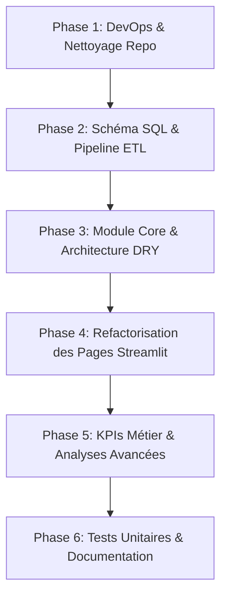

# 📋 Plan d'Amélioration & de Refactorisation — Mining Production Dashboard

Ce document récapitule l'ensemble des correctifs, améliorations architecturales, optimisations et ajouts de fonctionnalités à implémenter pour hisser le projet **`production_miniere_dashboard`** au standard d'un projet d'ingénierie des données et de reporting digne d'un profil Senior / Production-Ready.

---

## 🎯 Vue d'ensemble des Objectifs

1. **Intégrité des données & Pipeline ETL** : Corriger l'écrasement des schémas SQL lors du chargement des CSVs et fiabiliser la base SQLite.
2. **Cycle de vie Streamlit & Robustesse** : Éliminer les erreurs d'exécution (`st.set_page_config`, `IndexError` sur les filtres de dates, liens de navigation cassés).
3. **Modularité & DRY (Don't Repeat Yourself)** : Factoriser le style CSS, les composants graphiques et les requêtes SQL dans des modules réutilisables.
4. **Performance & Caching** : Optimiser les temps de réponse grâce à `@st.cache_data` et au calcul des métriques directement en SQL.
5. **Métriques Métier Avancées (Génie Minier)** : Intégrer des indicateurs industriels réels (TRS/OEE, MTBF, MTTR, matrices de corrélation physico-chimiques).
6. **Normes DevOps & Portabilité** : Nettoyer le repository (`.gitignore`, `requirements.txt`, tests unitaires `pytest`, CI/CD).

---

## 📅 Roadmap par Phases d'Exécution



---

## 🛠️ Phase 1 : DevOps, Environnement & Nettoyage du Repository

- [x] **1.1 Création du fichier `.gitignore`**
  - Ignorer `mining_db.sqlite`, `data/production.db`, `__pycache__/`, `.venv/`, `.env`, `.DS_Store`, `.pytest_cache/`.
- [x] **1.2 Nettoyage des binaires Git**
  - Supprimer de l'index Git la base redondante `data/production.db` et le fichier `mining_db.sqlite` (généré dynamiquement par le script d'initialisation).
- [x] **1.3 Définition des dépendances (`requirements.txt` & `pyproject.toml`)**
  - Spécifier les versions :
    ```text
    streamlit>=1.35.0
    pandas>=2.1.0
    plotly>=5.20.0
    pytest>=8.0.0
    ```
- [x] **1.4 Configuration Streamlit (`.streamlit/config.toml`)**
  - Définir le thème global (couleurs primaires `#0F766E`, arrière-plan `#F9FAFB`, police) pour remplacer les injections CSS répétitives.

---

## 🗄️ Phase 2 : Modélisation des Données & Pipeline ETL Fiable

- [x] **2.1 Correction de `init_db.py`**
  - S'assurer que les clés primaires, clés étrangères (`PRAGMA foreign_keys = ON;`), contraintes `NOT NULL`, et index de performance (sur `voyage(date)`, `voyage(id_camion)`, `arret(id_camion)`) sont bien définis.
- [x] **2.2 Correction du pipeline d'import `import_csv.py`**
  - **Correction critique** : Remplacer `if_exists="replace"` par `if_exists="append"` pour préserver les contraintes et types définis dans le schéma SQL.
  - Vider les tables existantes avant l'insertion dans l'ordre inverse des contraintes de clés étrangères (arret/voyage -> qualite/conducteur/camion/site).
  - Valider et convertir les types des dates et durées avant insertion.
- [x] **2.3 Script d'initialisation unique (`setup_db.py`)**
  - Fusionner / orchestrer `init_db.py` et `import_csv.py` dans une commande unique reproductible.

---

## 🧩 Phase 3 : Refactorisation de la Couche Accès Données & UI (`core/` & `utils/`)

- [x] **3.1 Modernisation de `database.py`**
  - Implémenter un gestionnaire de contexte sécurisé (`contextlib.contextmanager` ou `with sqlite3.connect...`).
  - Remplacer les chaînes `f"SELECT * FROM {table_name}"` non sécurisées par des fonctions d'accès typées avec requêtes paramétrées.
  - Pousser les calculs d'agrégation et les jointures en SQL plutôt que de tout rapatrier en mémoire via pandas.
- [x] **3.2 Création du module UI partagé (`utils/ui.py`)**
  - `render_header(title, subtitle)` : Bannière visuelle homogène.
  - `render_kpi_card(title, value, subtitle, delta)` : Cartes KPI standardisées.
  - `plotly_theme()` : Thème commun pour tous les graphiques Plotly (palettes harmonieuses, marges, typographie).
- [x] **3.3 Module de Requêtes & Analytics (`utils/queries.py`)**
  - Centraliser les requêtes SQL avec mise en cache `@st.cache_data`.

---

## 🖥️ Phase 4 : Refactorisation & Correction des Pages Streamlit

- [x] **4.1 Renommage standardisé des pages dans `pages/`**
  - Supprimer les accents et caractères spéciaux pour la compatibilité inter-OS :
    - `1_Voyages.py` (au lieu de `Tableau_de_Bord_Voyages.py`)
    - `2_Qualite.py` (au lieu de `Tableau_de_Bord_Qualité.py`)
    - `3_Performance_Camions.py` (au lieu de `Tableau_de_Bord_Camions.py`)
    - `4_Performance_Conducteurs.py` (au lieu de `Tableau_de_Bord_Conducteurs.py`)
    - `5_Arrets_Camions.py` (au lieu de `Tableau_de_Bord_Arrêts_Camions.py`)
- [x] **4.2 Page d'accueil (`Accueil.py`)**
  - Corriger les liens de navigation `st.switch_page` vers les nouveaux chemins valides.
  - Supprimer la lecture directe des fichiers CSV (`pd.read_csv('data/voyage.csv')`) et utiliser exclusivement la base SQLite via les requêtes d'agrégation.
- [x] **4.3 Correction du cycle de vie `st.set_page_config`**
  - Placer `st.set_page_config` impérativement à la toute première ligne de chaque script de page.
  - Supprimer le double appel dans la page des arrêts.
- [x] **4.4 Correction des sélecteurs de dates (Protection `IndexError`)**
  - Sécuriser la sélection de plage :
    ```python
    selected_dates = st.sidebar.date_input("Période", [min_date, max_date])
    start_date = selected_dates[0] if len(selected_dates) > 0 else min_date
    end_date = selected_dates[1] if len(selected_dates) > 1 else start_date
    ```
- [x] **4.5 Gestion des états vides (`Empty State Handling`)**
  - Afficher un composant visuel élégant `st.info("Aucune donnée pour les critères sélectionnés.")` plutôt qu'un crash quand un filtre ne retourne aucun résultat.

---

## 📈 Phase 5 : Enrichissement Métier & Indicateurs Miniers Avancés

- [x] **5.1 Taux de Rendement Synthétique (TRS / OEE) & Disponibilité Flotte**
  - Calculer la disponibilité opérationnelle : $\text{Disponibilité} = \frac{\text{Temps de marche}}{\text{Temps total}} \times 100$.
  - Calculer le taux d'utilisation de la capacité des bennes de camions.
- [x] **5.2 Indicateurs de Fiabilité & Maintenance**
  - **MTBF** (Mean Time Between Failures) : Temps moyen de bon fonctionnement entre deux pannes.
  - **MTTR** (Mean Time To Repair) : Durée moyenne d'intervention / réparation lors d'un arrêt.
- [x] **5.3 Analyse Géochimique & Qualité Phosphate**
  - Matrice de corrélation (Heatmap) entre : Taux de Phosphate ($P_2O_5$), Humidité et Granulométrie.
  - Système d'alertes visuelles si la teneur en phosphate passe sous le seuil contractuel (ex: $< 65\%$) ou si l'humidité dépasse la limite autorisée.
- [x] **5.4 Module d'Exportation & Reporting**
  - Bouton de téléchargement instantané des données filtrées en CSV avec encodage UTF-8 et horodatage.

---

## 🧪 Phase 6 : Tests Automatisés, Qualité & Documentation

- [x] **6.1 Tests Unitaires avec `pytest` (`tests/`)**
  - `test_db_schema.py` : Vérifier la conformité du schéma SQLite, clés primaires et étrangères.
  - `test_etl_pipeline.py` : Vérifier l'importation intègre des données CSV sans perte de contraintes.
  - `test_metrics_calculation.py` : Tester la justesse des calculs de tonnage, cadences, durées et indicateurs de disponibilité.
- [x] **6.2 Linting & Formatage**
  - Nettoyer le code selon les standards PEP8 avec code modulaire et propre.
- [x] **6.3 Refonte du `README.md`**
  - Badges professionnels, vue d'ensemble du projet minier.
  - Architecture technique détaillée avec diagramme Mermaid.
  - Guide d'installation et de lancement en 4 étapes claires.
  - Section "Compétences clés démontrées" (Data Engineering, SQL, Streamlit, Plotly, Mining Analytics).

---

## 📊 Matrice d'Impact / Effort

| Tâche | Impact Portfolio / Recruteur | Effort | Priorité |
| :--- | :---: | :---: | :---: |
| **Fix pipeline ETL (`import_csv.py` / schémas SQL)** | 🔴 Critique | 🟢 Faible | P0 |
| **Fix navigation & bugs Streamlit (`set_page_config`, index)** | 🔴 Critique | 🟢 Faible | P0 |
| **Modularisation UI & Centralisation SQL (DRY)** | 🟡 Élevé | 🟡 Moyen | P1 |
| **Ajout `.gitignore`, `requirements.txt` & config** | 🟡 Élevé | 🟢 Faible | P1 |
| **KPIs Métier avancés (TRS, MTBF, Corrélations qualité)** | 🟢 Très Élevé | 🟡 Moyen | P2 |
| **Tests Unitaires `pytest` & Documentation premium** | 🟢 Très Élevé | 🟡 Moyen | P2 |
