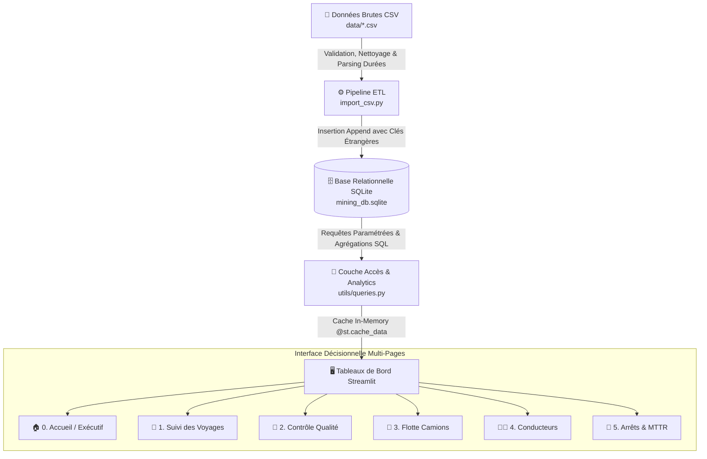

# ⛏️ Système de Gestion de la Production Minière (Phosboucraa)
### *Mining Production Operations, Haulage Analytics & Quality Control Dashboard*

[](https://www.python.org/)
[](https://streamlit.io/)
[](https://www.sqlite.org/)
[](https://plotly.com/)
[](https://pytest.org/)

---

## 📖 Présentation du Projet

Application décisionnelle et d'ingénierie des données conçue pour la supervision et l'optimisation des opérations d'extraction, de transport et de contrôle qualité du minerai de phosphate sur le site de **Phosboucraa**.

Le système assure l'ingestion automatisée des flux de données opérationnels (via un pipeline ETL sécurisé), garantit l'intégrité relationnelle dans **SQLite**, et délivre des indicateurs industriels temps réel (TRS/OEE, MTTR, cadences de transport, conformité chimique $P_2O_5$) à travers une interface interactive **Streamlit**.

---

## 🏗️ Architecture & Flux de Données



---

## 🌟 Fonctionnalités & Modules

### 1. 🏠 Tableau de Bord Exécutif (`Accueil.py`)
- Synthèse globale : Tonnage cumulé, voyages, disponibilité de la flotte, effectifs mobilisés.
- Courbes d'évolution journalière bi-axe (Tonnage vs Nombre de rotations).
- Répartition des flux de production par site minier d'extraction.
- Registre en direct des dernières expéditions.

### 2. 🚛 Suivi des Voyages (`pages/1_Voyages.py`)
- Filtres dynamiques : Période (sécurisée), camion, conducteur, site de destination.
- Indicateurs clés : Cadence horaire ($T/h$), distance moyenne, durée de cycle moyen.
- Analyse de corrélation : Distance vs Charge transportée selon le modèle de camion.
- Export instantané des données filtrées au format CSV (UTF-8).

### 3. 🧪 Contrôle Qualité & Géochimie (`pages/2_Qualite.py`)
- Surveillance des teneurs en phosphate ($P_2O_5$), humidité et granulométrie.
- Taux de conformité commerciale ($P_2O_5 \ge 65\%$) et alertes de dépassement d'humidité ($> 8\%$).
- Matrice de corrélation physico-chimique interactive (Heatmap).

### 4. 🚚 Performance & Rendement Flotte (`pages/3_Performance_Camions.py`)
- Classement des camions par productivité et taux d'utilisation de la benne.
- Comparatif des performances par constructeur (Mercedes, MAN, Iveco).
- Matrice quadrant : Tonnage acheminé vs Temps d'arrêt (détection des anomalies de rendement).

### 5. 👨‍💼 Performance des Conducteurs (`pages/4_Performance_Conducteurs.py`)
- Suivi de la productivité par chauffeur, volume transporté et assiduité.
- Évaluation de la sécurité : fréquence et motifs d'incidents déclarés.

### 6. 🛑 Suivi des Arrêts & Maintenance (`pages/5_Arrets_Camions.py`)
- Diagnostic des arrêts par typologie (Panne, Maintenance préventive, Pause).
- Calcul du **MTTR** (*Mean Time To Repair*) sur les pannes mécaniques.
- Analyse des causes racines (Crevaison, Vidange, Problèmes moteur...).

---

## 🗄️ Modèle de Données (Schéma Relationnel)

```text
site (id_site [PK], nom, localisation)
camion (id_camion [PK], matricule, capacite, modele)
conducteur (id_conducteur [PK], nom, prenom, CIN)
qualite (id_qualite [PK], categorie, nom_de_produit, granulometrie, taux_phosphate, humidite)
voyage (id_voyage [PK], date, heure_depart, heure_arrive, distance_km, quantite_transporte, id_conducteur [FK], id_camion [FK], id_site [FK], id_qualite [FK])
arret (id_arret [PK], date_heure, duree, duree_minutes, type, raison, id_camion [FK], id_conducteur [FK])
```

---

## 🚀 Installation & Lancement Rapide

### 1. Cloner le projet & créer l'environnement virtuel

```bash
git clone https://github.com/laila-kz/production_miniere_dashboard.git
cd production_miniere_dashboard

# Créer l'environnement virtuel (Python 3.9+)
python -m venv .venv

# Activer l'environnement :
# Windows (PowerShell) :
.venv\Scripts\Activate.ps1
# Linux / macOS :
source .venv/bin/activate
```

### 2. Installer les dépendances

```bash
pip install -r requirements.txt
```

### 3. Initialiser la base de données & Ingestion ETL

```bash
python setup_db.py
```

### 4. Démarrer l'application Streamlit

```bash
streamlit run Accueil.py
```

L'application s'ouvrira automatiquement à l'adresse : `http://localhost:8501`

---

## 🧪 Tests Automatisés

Le projet inclut une suite de tests unitaires et d'intégration avec **Pytest** :

```bash
pytest
```

**Couverture des tests :**
- `test_db_schema.py` : Validation du schéma SQLite, contraintes de clés étrangères et index.
- `test_etl_pipeline.py` : Validation de l'import CSV, parsing des durées et intégrité relationnelle.
- `test_metrics_calculation.py` : Validation des calculs de KPIs, jointures SQL et filtrage.

---

## 💡 Compétences Clés Démontrées

- **Data Engineering & ETL** : Pipeline d'ingestion robuste avec vérification des clés étrangères et transformation de formats.
- **Modélisation SQL & Indexation** : Schéma relationnel normalisé, requêtes d'agrégation performantes et context managers.
- **Analytics & KPIs Métier** : Métriques industrielles du secteur minier (MTTR, OEE, flux horaire $T/h$, géochimie $P_2O_5$).
- **Visualisation & UI/UX** : Dashboards Streamlit modulaires (DRY), thème personnalisé, graphiques interactifs Plotly.
- **DevOps & Qualité** : Tests unitaires automatisés (`pytest`), gestion de configuration (`pyproject.toml`), bonnes pratiques Git (`.gitignore`).
